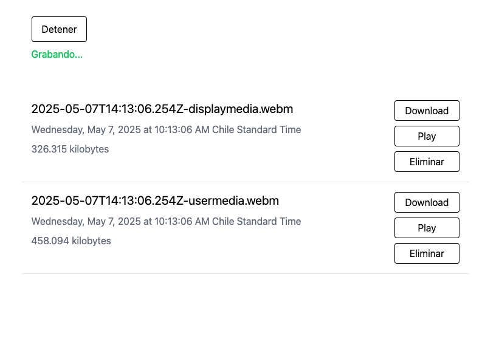

# Recorder

Recorder is a web-based project designed to record various data sources, such as screen and microphone audio. It is intended to make it easy to record meetings or videos directly from the browser. You can view a demo of the project at [jondotsoy.github.io/recorder/](https://jondotsoy.github.io/recorder/). Additionally, the project stores videos and audio locally in the browser, making it simple to access your recordings later.



## Setup

It is recommended to use [Bun](https://bun.sh) as the JavaScript runtime for this project. Bun provides faster performance and a seamless developer experience.

### Steps to Get Started

1. Install Bun by following the instructions at [bun.sh](https://bun.sh).
2. Install the project dependencies:
    ```bash
    bun install
    ```
3. Start the development server:
    ```bash
    bun dev
    ```

## LICENSE

This project is licensed under the MIT License. See the [LICENSE](./LICENSE) file for details.
